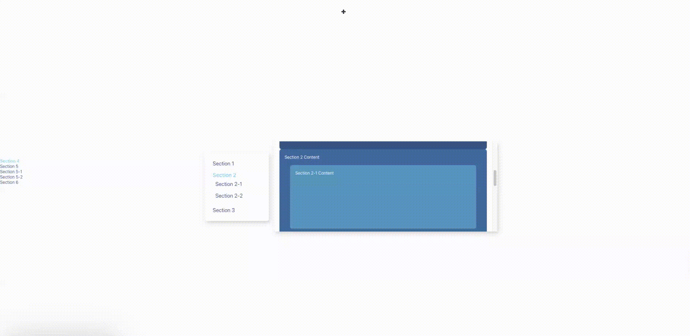

# EaseAnchor

[中文文档](./README-CN.md)

EaseAnchor is a flexible React anchor navigation component that provides easy-to-use in-page navigation functionality. It supports multi-level nested anchor structures, customizable scroll containers and styles, and offers both smooth scrolling and instant jump modes. **(Currently in beta version)**

## Features

- Supports multi-level nested anchor structures
- Customizable scroll container
- Supports smooth scrolling and instant jumping
- Automatically detects and highlights currently visible anchors
- Customizable styles and class names for anchor items
- Supports setting initial active anchor via URL hash or default value
- Provides a global click callback function



## Installation

```bash
npm install ease-anchor
```

## Usage

```jsx
import React from 'react';
import EaseAnchor from 'ease-anchor';

const App = () => {
  const items = [
    { href: 'section1', content: 'Section 1' },
    { href: 'section2', content: 'Section 2' },
    {
      href: 'section3',
      content: 'Section 3',
      children: [
        { href: 'section3-1', content: 'Section 3.1' },
        { href: 'section3-2', content: 'Section 3.2' },
      ],
    },
  ];

  return (
    <div>
      <EaseAnchor items={items} offset={60} />
      <div id="section1">Section 1 content</div>
      <div id="section2">Section 2 content</div>
      <div id="section3">
        Section 3 content
        <div id="section3-1">Section 3.1 content</div>
        <div id="section3-2">Section 3.2 content</div>
      </div>
    </div>
  );
};

export default App;
```

[More usage examples](./demo/src/App.jsx)

## API

### EaseAnchor Props

| Property        | Type                                        | Default | Description                                    |
| --------------- | ------------------------------------------- | ------- | ---------------------------------------------- |
| items           | AnchorItem[]                                | -       | Array of anchor items defining the structure   |
| scrollContainer | string \| HTMLElement                       | window  | ID or HTMLElement of the scroll container      |
| offset          | number                                      | 0       | Scroll offset                                  |
| animation       | boolean                                     | true    | Whether to use smooth scrolling                |
| onClick         | (href: string, hierarchy: string[]) => void | -       | Callback function when an anchor is clicked    |
| className       | string                                      | ''      | Custom class name for the navigation container |
| style           | CSSProperties                               | {}      | Custom style for the navigation container      |
| itemClassName   | string                                      | ''      | Custom class name for anchor items             |
| itemStyle       | CSSProperties                               | {}      | Custom style for anchor items                  |
| defaultValue    | string                                      | -       | Default active anchor href                     |

### AnchorItem

The `AnchorItem` interface defines the structure of each anchor item:

| Property | Type                                                           | Description                   |
| -------- | -------------------------------------------------------------- | ----------------------------- |
| href     | string                                                         | Target ID of the anchor       |
| content  | ReactNode \| ((isActive: boolean, level: number) => ReactNode) | Display content of the anchor |
| children | AnchorItem[]                                                   | Optional, child anchor items  |

## Basic Usage

### Custom Scroll Container

You can specify a custom scroll container using the `scrollContainer` prop:

```jsx
<EaseAnchor items={items} scrollContainer="custom-container" />
```

### Dynamic Content

You can use a function to dynamically generate anchor content:

```jsx
const items = [
  {
    href: 'dynamic',
    content: (isActive, level) => (
      <span style={{ color: isActive ? 'red' : 'black' }}>Dynamic Content (Level: {level})</span>
    ),
  },
];
```

### Using Callback Function

You can use the onClick callback to perform custom actions:

```jsx
const handleClick = (href, hierarchy) => {
  console.log(`Clicked: ${href}, Hierarchy: ${hierarchy.join(' > ')}`);
};

<EaseAnchor items={items} onClick={handleClick} />;
```

## License

EaseAnchor is licensed under the MIT License. See the [LICENSE](./LICENSE) file for more information.

### Contact Us

If you have any questions or suggestions, please contact us through:

- Submitting a GitHub Issue
- Sending an email to xavihe.work@outlook.com

Thank you for using EaseAnchor!
